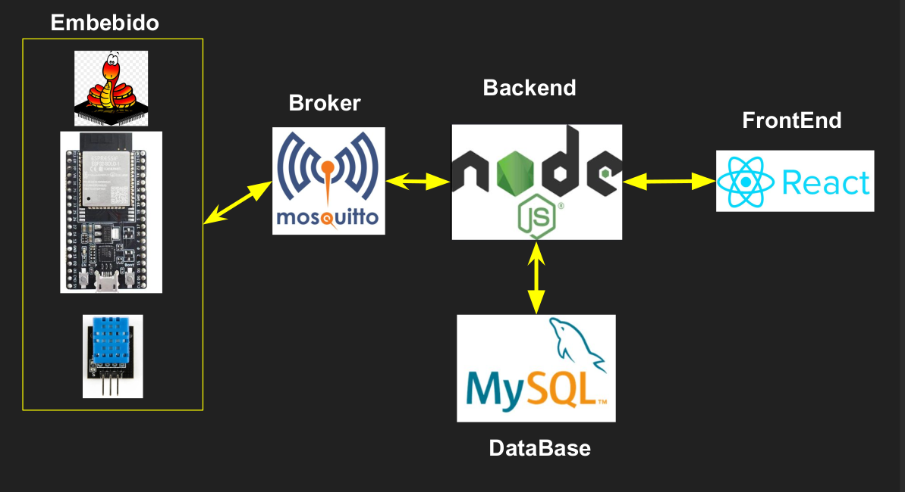

# Trabajo Pratico 


## Firmware

Este proyecto utiliza MicroPython y ESP-IDF para controlar un microcontrolador ESP32 y un sensor DHT11.

### Tecnologías Utilizadas

- **MicroPython**: Versión 1.22.2
  - [Repositorio de MicroPython](https://github.com/micropython/micropython)
- **ESP-IDF**: Versión 5.0.4
  - Clonar el repositorio: 
    ```bash
    git clone -b v5.0.4 --recursive https://github.com/espressif/esp-idf.git
    ```

### Componentes

- **Microcontrolador**: ESP32
- **Sensor**: DHT11

### Conexión al Broker

Nos conectamos al broker de Mosquitto mediante certificados TLS para asegurar la comunicación. 

## Backend

Utilizamos Node.js y Express para el desarrollo del backend, y también nos conectamos al broker Mosquitto mediante certificados TLS para asegurar la comunicación.

### Tecnologías Utilizadas

- **Node.js**
- **Express**
- **Mosquitto**
- **MySQL**

### Conexión al Broker
En el archivo mqttHandler.js esta la conexion del backend al broker de mosquitto a traves de TLS

### Base de datos
Use MySQL server y cree esta en local, hay un archivo llamado crear_tabla_mysql.txt de como la cree a esta base de datos y la respetiva tabla

## Frontend

El frontend de este proyecto fue desarrollado utilizando React.

El archivo principal, `Nodeinfo.js`, ubicado en `/frontend/src/components`, contiene la mayor parte de la funcionalidad del frontend. Este archivo maneja la conexión con el broker Mosquitto, permitiendo la publicación de mensajes al presionar un botón designado. Además, define la interfaz de usuario.

### Tecnologías Utilizadas

- **React**

